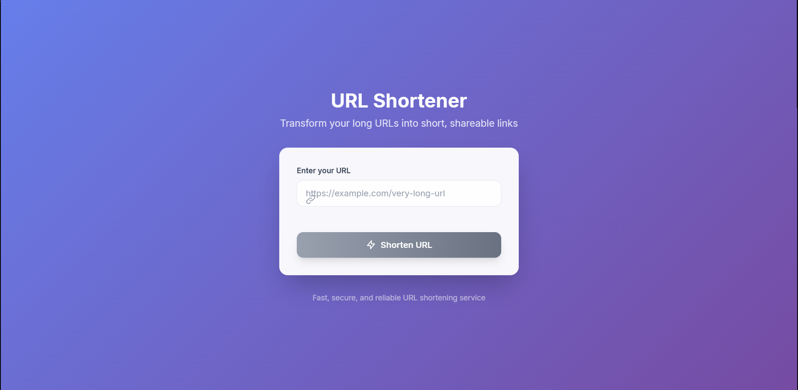
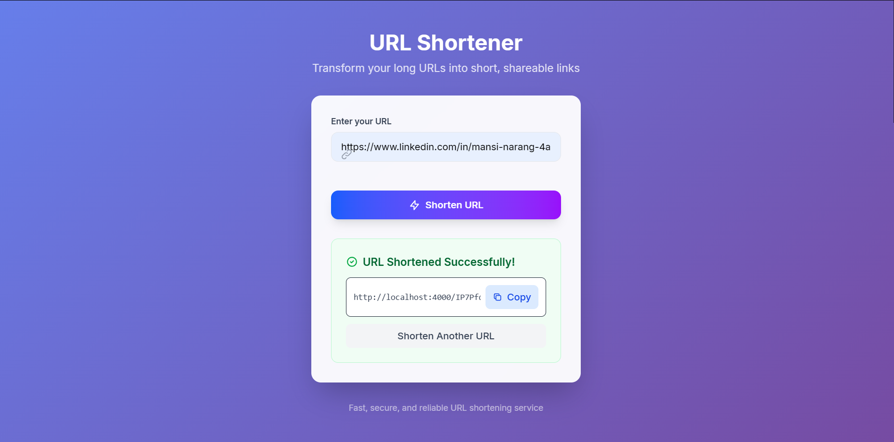

# URL Shortener App

A full-stack URL shortener application built as a learning project using **React** (frontend), **Node.js/Express** (backend), and **MongoDB** for storage.

## Features

- Shorten long URLs to short, shareable links
- Copy shortened URLs to clipboard
- Redirect to original URLs via short links
- Responsive, modern UI with Tailwind CSS
- Built with React, Vite, Express, and MongoDB


## Screenshots



## Project Structure

```
.
├── backend
│   ├── index.js           # Express server and API routes
│   ├── package.json
│   ├── .env               # Environment variables (not committed)
│   ├── models/
│   │   └── url.js         # Mongoose model for URLs
│   ├── Schemas/
│   │   └── url.js         # Mongoose schema for URLs
│   └── utils/
│       └── randomKey.js   # Random short key generator
└── frontend
    ├── src/
    │   ├── App.jsx        # Main React component
    │   ├── App.css        # App-specific styles
    │   ├── index.css      # Global styles (Tailwind)
    │   └── main.jsx       # React entry point
    ├── public/
    ├── index.html
    ├── package.json
    ├── vite.config.js
    └── README.md
```

## Getting Started

### Prerequisites

- Node.js (v18+ recommended)
- npm or yarn
- MongoDB instance (local or cloud)

### Backend Setup

1. Navigate to the `backend` folder:
   ```sh
   cd backend
   ```
2. Install dependencies:
   ```sh
   npm install
   ```
3. Create a `.env` file with:
   ```
   PORT=4000
   MONGODB_URL=your_mongodb_connection_string
   ```
4. Start the backend server:
   ```sh
   npm run dev
   ```

### Frontend Setup

1. Navigate to the `frontend` folder:
   ```sh
   cd frontend
   ```
2. Install dependencies:
   ```sh
   npm install
   ```
3. Start the frontend development server:
   ```sh
   npm run dev
   ```
4. Open [http://localhost:5173](http://localhost:5173) in your browser.

## Usage

- Enter a long URL in the input field and click "Shorten URL".
- Copy the generated short URL and share it.
- Visiting the short URL will redirect to the original link.

## Learning Goals

- Practice building RESTful APIs with Express and MongoDB
- Explore React hooks and component design
- Implement modern styling with Tailwind CSS
- Understand full-stack integration and CORS

## License

This project is for learning